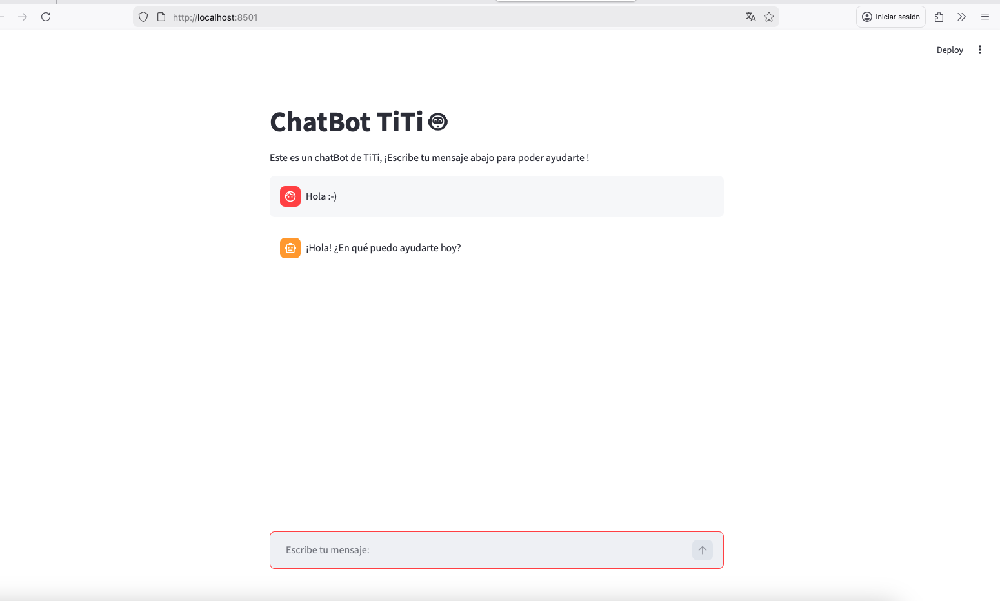

# Configuración Inicial (Setup)

Instrucciones y requisitos previos para configurar el entorno de desarrollo y ejecutar la aplicación del chatbot.

## 0. Tecnologías Utilizadas
Antes de empezar, este proyecto se construye sobre las siguientes bases tecnológicas:

*   **Python:** El *lenguaje de programación* que vertebra todo el código. Usamos Python por su inmenso ecosistema orientado a la Inteligencia Artificial.
*   **LangChain:** Es un *Framework* (marco de trabajo). Actúa como el "cerebro orquestador" que nos permite conectar nuestro código con modelos de IA, manejar la memoria del chat y definir cómo preguntarle al modelo usando un estándar aplicable a cualquier IA.
*   **Streamlit:** Es una *Librería / Micro-framework*. Se usa para construir la interfaz gráfica (UI) de la aplicación web directamente en código Python puro, sin necesidad de saber HTML, CSS o Javascript. Ella nos dibuja la web y el chat.
*   **langchain-google-genai** y **langchain-openai:** Son *Librerías integradoras*. Actúan como los "enchufes" específicos que traducen el formato estándar de LangChain al formato propietario que entienden las APIs de Google (Gemini) o de OpenAI (ChatGPT).

***

## 1. Instalación de Python
Python es el intérprete requerido para ejecutar los scripts del proyecto.

*   **Descarga:** [Página oficial de Python (python.org)](https://www.python.org/downloads/)
*   **Verificación:** Abre la terminal y ejecuta `python3 --version`. Se recomienda Python 3.10 o superior.

***

## 2. Entornos Virtuales (`virtual_env`)
Un entorno virtual es un directorio aislado que contiene su propia instalación de Python y un gestor de paquetes (`pip`). 

*   **Propósito:** Aislar las dependencias del proyecto actual respecto al entorno global del sistema operativo u otros proyectos. Esto evita conflictos de versiones (ej: Proyecto A requiere librería v1.0, Proyecto B requiere librería v2.0).
*   **Creación:** Ejecutar en el directorio raíz del proyecto:
    ```bash
    python3 -m venv virtual_env
    ```
*   **Activación:** Antes de instalar dependencias o ejecutar código, el entorno debe activarse:
    *   *macOS/Linux:* `source virtual_env/bin/activate`
    *   *Windows:* `.\virtual_env\Scripts\activate`

*(Al activarlo, la terminal mostrará el prefijo `(virtual_env)`).*

***

## 3. Instalación de Dependencias
Con el entorno virtual activado, instala los paquetes requeridos mediante `pip`:

*   **langchain:** Framework principal para orquestar la lógica del LLM (Modelos de Lenguaje Grande).
*   **langchain-google-genai:** Proveedor oficial de LangChain para conectar con la API de modelos Gemini de Google.
*   **langchain-openai:** Proveedor para conectar con la API de OpenAI (ChatGPT). *Nota: Útil como alternativa si no se quiere usar Gemini.*
*   **streamlit:** Librería para el desarrollo ágil de interfaces gráficas y aplicaciones web directamente en Python.

**Comando de instalación:**
```bash
pip install langchain langchain-google-genai langchain-openai streamlit
```

***

## 4. Configuración del Proveedor IA (Google vs OpenAI)
El código base está preparado para funcionar tanto con Google Gemini como con OpenAI (ChatGPT). Para que el bot responda necesitas una API Key.

*   **Para usar Google Gemini (Actual):**
    1. Genera una clave gratuita en [Google AI Studio](https://aistudio.google.com/).
    2. Pon la clave en la variable `google_api_key="[TU_CLAVE]"` dentro del código.
*   **Para usar OpenAI (Alternativa):**
    1. Genera una clave en [OpenAI Developer Platform](https://platform.openai.com/api-keys).
    2. En el archivo `chatbot_streamlit.py`, comenta el bloque de código de `ChatGoogleGenerativeAI`.
    3. Descomenta el bloque alternativo etiquetado como `ChatOpenAI` y pon ahí tu `api_key`.

***

## 5. Ejecución de la Aplicación
Una vez configurado y con el entorno virtual activo, dirígete a la carpeta correspondiente y arranca el servidor web local:

```bash
cd topic_0
streamlit run chatbot_streamlit.py
```

***

## 6. Interfaz Gráfica (Navegador)
Al ejecutar el comando anterior, pasará lo siguiente:

1. El terminal te mostrará dos URLs: una `Network URL` y una `Local URL`.
2. Automáticamente se abrirá una nueva pestaña en tu navegador predeterminado (suele apuntar a **`http://localhost:8501`**).
3. Si la ventana no se abre sola, puedes copiar y pegar ese enlace (`http://localhost:8501`) en el navegador.

A partir de ahí, puedes interactuar con la interfaz del chatbot directamente desde la web.
